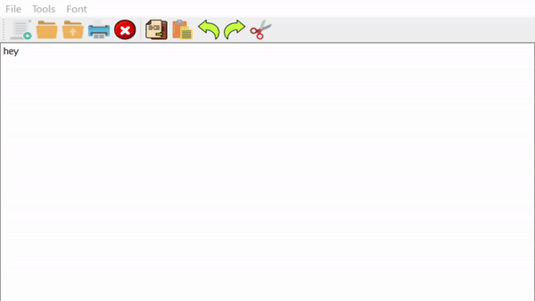

<h1 align="center"><strong><em>Notepad</strong></em></h1>

  
# How to run the app?

To run this application: 
 

* You have to have installed latest Visual C++ Redistributable for Visual Studio 2015, 2017 and 2019. You can get it from here: <a href ="https://support.microsoft.com/en-us/topic/the-latest-supported-visual-c-downloads-2647da03-1eea-4433-9aff-95f26a218cc0">Link</a>
* After that accees the <a href="https://github.com/Yashmerino/NP/releases">Releases</a> section and download the last version of the application.
* Right-click the zipped folder saved to your computer and choose "Extract All". Run the application and enjoy!

<h1 align="center"><strong>Demonstration</strong></h1>

